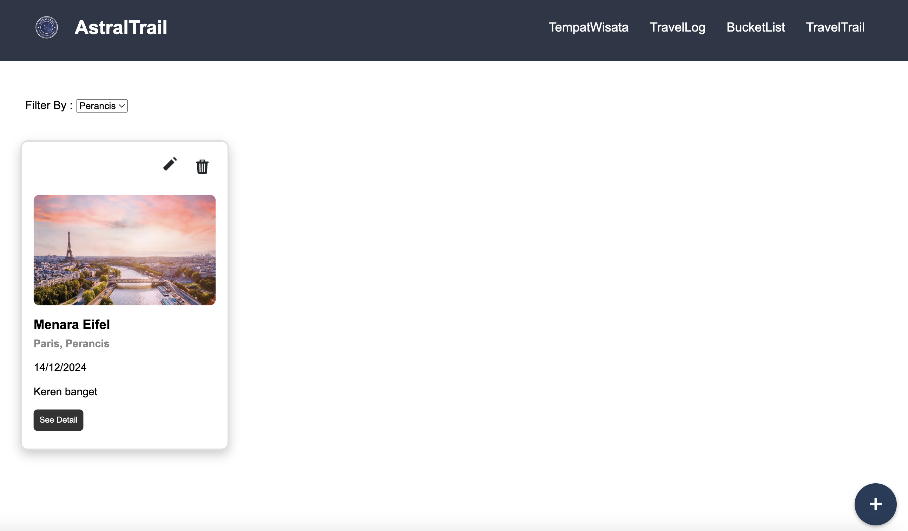
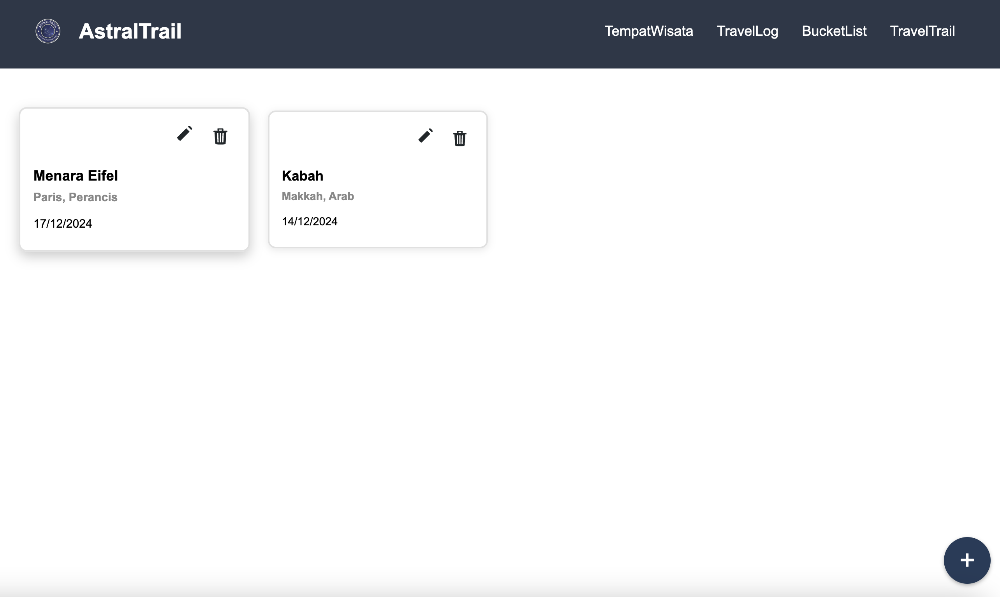
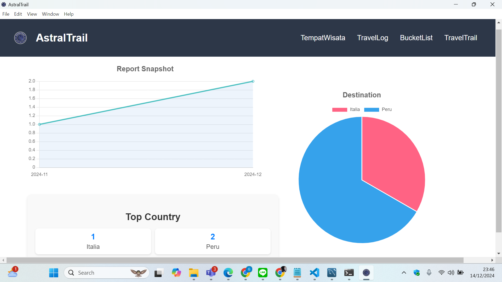
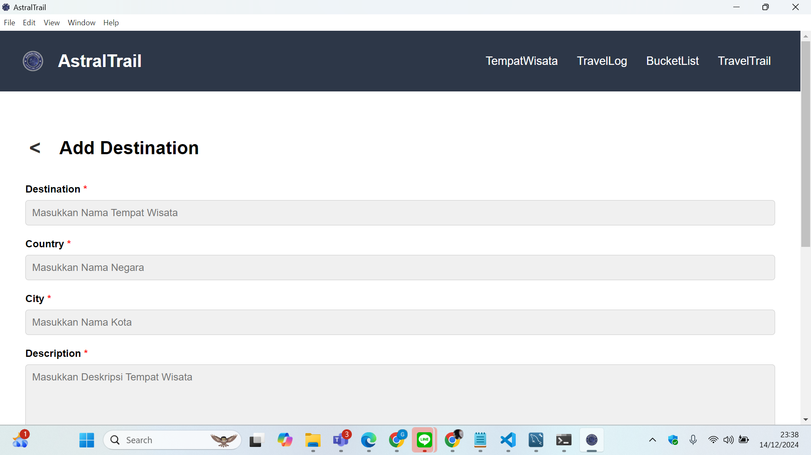
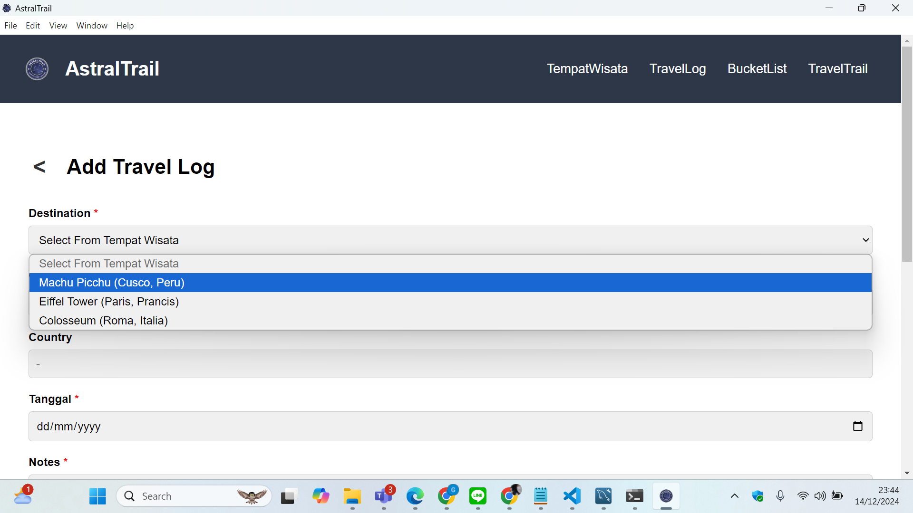
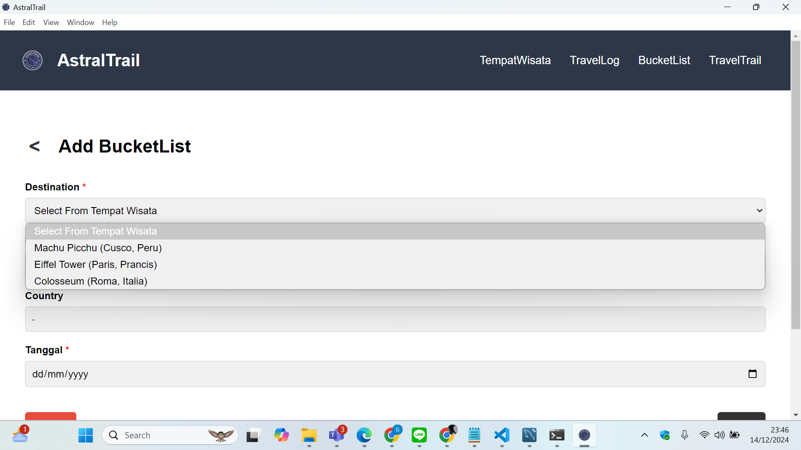

<h1 align="center">AstralTrail</h1>
<h3 align="center">Capture Every Journey</h3>

## Table of Contents

- [Description](#description)
- [Getting Started](#getting-started)
- [Modules](#modules)
- [Database Table](#database-table)

## Description
**AstralTrail** is a desktop application built with Python 3, designed to help users record and manage their travel information. The app enables users to document their experiences from visited destinations and create a list of places they wish to explore in the future. With its intuitive features, AstralTrail also provides travel statistics and a history of visited locations, making it a practical solution for individuals seeking a more organized way to manage their travel plans.

**AstralTrail** adalah aplikasi desktop berbasis Python 3 yang dirancang untuk membantu pengguna mencatat dan mengelola informasi perjalanan mereka. Aplikasi ini memungkinkan pengguna untuk mendokumentasikan pengalaman dari destinasi yang telah dikunjungi serta menyusun daftar lokasi yang ingin dijelajahi di masa depan. Dengan fitur yang intuitif, AstralTrail juga menyediakan visualisasi statistik perjalanan dan riwayat destinasi, menjadikannya solusi praktis bagi individu yang ingin mengorganisasi perjalanan dengan lebih terstruktur.

## Getting Started

1. **Clone this repository:**
   ```bash
   git clone https://github.com/AlfianHanifFY/IF2150-2024-K01-G07-AstralTrail.git
   ```
2. **cd to your repo**
   ```bash
   cd your-repo
   ```

## Back-End Setup

1. **Install Python and MySQL**<br/>
   Make sure you have the following installed:

   - [Python 3.x](https://www.python.org/downloads/)
   - [MySQL Server](https://dev.mysql.com/downloads/)
   - `pip` (Python package manager)
   - Any terminal/CLI tool of your choice (Windows CMD, macOS Terminal, etc.)

2. **Set Up Virtual Environment** <br/>
   Create a virtual environment to isolate dependencies:

   ```bash
   python -m venv venv
   ```

   Activate the virtual env

   - Windows

   ```bash
   .\venv\Scripts\activate
   ```

   - macOS/Linux

   ```bash
   source venv/bin/activate
   ```

3. **Install Dependencies** <br/>
   Install the required Python packages using `pip`:

   ```bash
   pip install -r requirements.txt
   ```

4. **Configure Environment Variables** <br/>
   Create a .env file in the root of your project with the following content:

   ```bash
   # Database configuration
   DB_HOST=localhost
   DB_USER=root
   DB_PASSWORD=your_password
   DB_NAME=your_database_name
   ```

   - Replace the placeholder values with your actual database connection details.

5. **Set Up Database** <br/>
   On MySql Monitor Create Database that will be used.

   ```bash
   CREATE DATABASE your_database_name;
   ```

6. **Set Up Tables** <br/>

   ```bash
   cd src/backend
   ```

   run this file to generate tables.

   ```bash
   python create_tables.py
   ```

7. **Run Server** <br/>
   ```bash
   flask run
   ```

## Front-End Setup

1. **Navigate to the src/frontend by running the following command in the terminal:**

   ```bash
   cd src/frontend
   ```

2. **Install dependencies:**
   ```bash
   npm install
   ```
3. **Start the Electron app in development mode:**
   ```bash
   npm start
   ```

## Modules
| **Modules Name**            | **Develop By**      |**Image**                                            |
|-----------------------------|---------------------|-----------------------------------------------------|
| Tempat Wisata               | 13523091            |           |
| Travel Log                  | 13523107            |                 |
| Bucket List                 | 13523121            |               |
| Travel Trail                | 13522051            |             |
| Form Tempat Wisata          | 13523091            | | 
| Form Travel Log             | 13523107            |       |
| Form Bucket List            | 13523121            |    |
| Database                    | 13523121            |                     |

## Database Table
The following is a list of the tables that have been implemented:

#### Tempat Wisata Data Table
| **Attribute Name**    | **Visibility** (private, public) | **Type** |
|-----------------------|----------------------------------|----------|
| id                    | private                          | int      |
| NamaTempatWisata      | private                          | string   |
| NamaNegara            | private                          | string   |
| NamaKota              | private                          | string   |
| Deskripsi             | private                          | string   |
| Foto                  | private                          | jpg      |

#### Travel Log Data Table
| **Attribute Name**    | **Visibility** (private, public) | **Type** |
|-----------------------|----------------------------------|----------|
| id                    | private                          | int      |
| NamaTempatWisata      | private                          | string   |
| NamaNegara            | private                          | string   |
| NamaKota              | private                          | string   |
| Deskripsi             | private                          | string   |
| Tanggal               | private                          | date     |
| Foto                  | private                          | jpg      |

#### Bucket List Data Table
| **Attribute Name**    | **Visibility** (private, public) | **Type** |
|-----------------------|----------------------------------|----------|
| id                    | private                          | int      |
| NamaTempatWisata      | private                          | string   |
| NamaNegara            | private                          | string   |
| NamaKota              | private                          | string   |
| Deskripsi             | private                          | string   |
| Foto                  | private                          | jpg      |